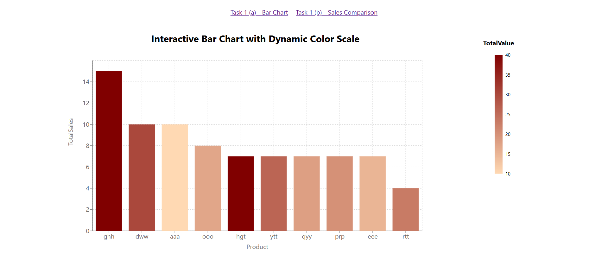
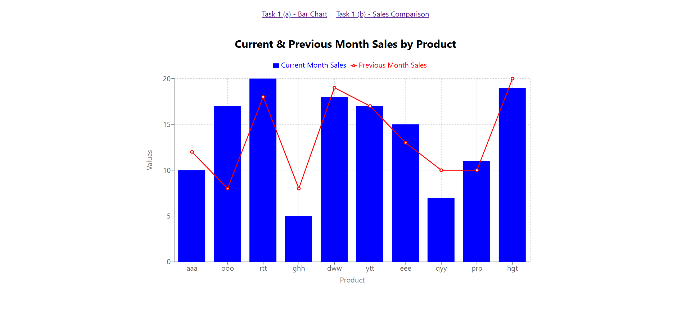

# Task 1: Bar Chart Visualizations

This project demonstrates data visualization using React and Recharts to build interactive bar and composed charts. It fetches data from remote CSV files, processes the data dynamically, and visualizes it with customizable tooltips, color scales, and interactivity.

## Table of Contents
- [Project Overview](#project-overview)
- [Features](#features)
- [Folder Structure](#folder-structure)
- [Installation](#installation)
- [Usage](#usage)
- [Technologies Used](#technologies-used)
- [Screenshots](#screenshots)
- [Future Enhancements](#future-enhancements)

---

## Project Overview

The project is divided into two tasks:

1. **Task 1 (a):** Create an interactive bar chart displaying sales data with a color scale based on total value.
2. **Task 1 (b):** Compare the sales of products for the current and previous months using a composed chart (bar + line).

These visualizations are aimed at providing an intuitive view of product sales trends for business insights.

---

## Features

- **Task 1 (a):**
  - Displays a bar chart for product sales data.
  - Includes a color gradient legend based on `TotalValue` of products.
  - Custom tooltips showing detailed product data.

- **Task 1 (b):**
  - Compares sales data of products for the current and previous months.
  - Combines bar and line charts for a comprehensive view.
  - Sorts products based on a predefined order.

- Dynamic data fetching and parsing from Google Sheets CSV files.
- Responsive design for seamless experience on all screen sizes.

---

## Folder Structure

Below is the folder structure of the project, with comments to explain the purpose of each file/folder.

```
task1/
├── src/                       # Source code directory
├── assets/                    # Contains project assets such as images, screenshots, and other media files
│   ├── task1a.png             # Screenshot for Task 1 (a) - Interactive Bar Chart
│   ├── task1b.png             # Screenshot for Task 1 (b) - Sales Comparison Chart
│   ├── components/            # Reusable components for the charts
│   │   ├── BarChartComponentA.jsx   # Renders Task 1 (a) bar chart
│   │   ├── BarChartComponentB.jsx   # Renders Task 1 (b) composed chart
│   ├── services/              # Services for data fetching
│   │   ├── fetchCSV.js        # Utility to fetch and parse CSV data
│   ├── utils/                 # Helper files and constants
│   │   ├── constants.js       # Contains URLs for data sources
│   ├── App.css                # Styling for the main app
│   ├── App.js                 # Main application with routing logic
│   ├── App.test.js            # Unit tests for the App component
│   ├── index.css              # Global styles
│   ├── index.js               # React entry point
│   ├── logo.svg               # Default React logo
│   ├── reportWebVitals.js     # Performance reporting (optional)
│   ├── setupTests.js          # Setup for testing utilities
├── package-lock.json          # Lock file for installed dependencies
├── package.json               # Lists project dependencies and scripts
├── README.md                  # Documentation for the project
```

---

## Installation

Follow these steps to set up and run the project locally:

1. **Clone the repository:**
   ```bash
   git clone https://github.com/ilhamclive/Renata-PLC.git
   ```

2. **Navigate to the repository folder:**
   ```bash
   cd Renata-PLC
   cd task1
   ```

3. **Install dependencies:**
   ```bash
   npm install
   ```

4. **Run the project:**
   ```bash
   npm start
   ```

   The application will be available at `http://localhost:3000`.

---

## Usage

- Navigate between tasks using the navigation bar:
  - **Task 1 (a):** Displays a bar chart with color scaling.
  - **Task 1 (b):** Displays a composed chart comparing current and previous month sales.
- The charts fetch real-time data from Google Sheets CSVs.

---

## Technologies Used

- **React:** Frontend framework for building user interfaces.
- **Recharts:** Library for creating responsive charts.
- **D3-Scale:** Provides a color scale for the bar chart.
- **React Router:** Enables navigation between tasks.
- **Papa Parse:** Parses CSV data into JSON format.

---

## Screenshots

### Task 1 (a) - Bar Chart
The following screenshot shows the interactive bar chart for Task 1 (a):



### Task 1 (b) - Sales Comparison
The following screenshot shows the composed chart comparing sales for Task 1 (b):




## Future Enhancements

- Add support for filtering and sorting the charts dynamically.
- Include more visualization options (e.g., pie charts, scatter plots).
- Enhance accessibility for visually impaired users.
