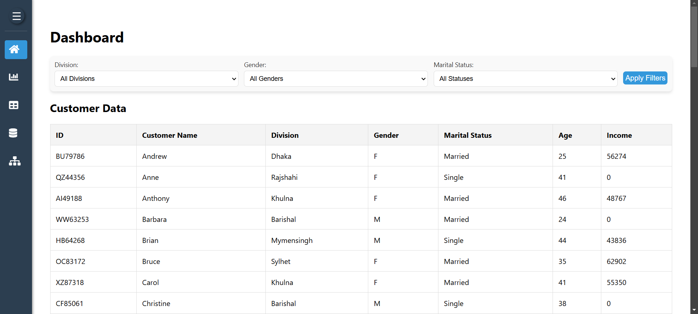
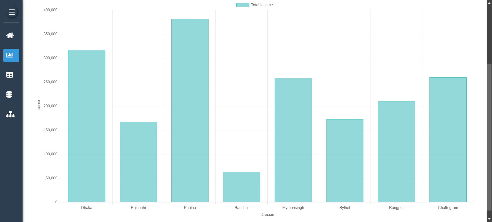
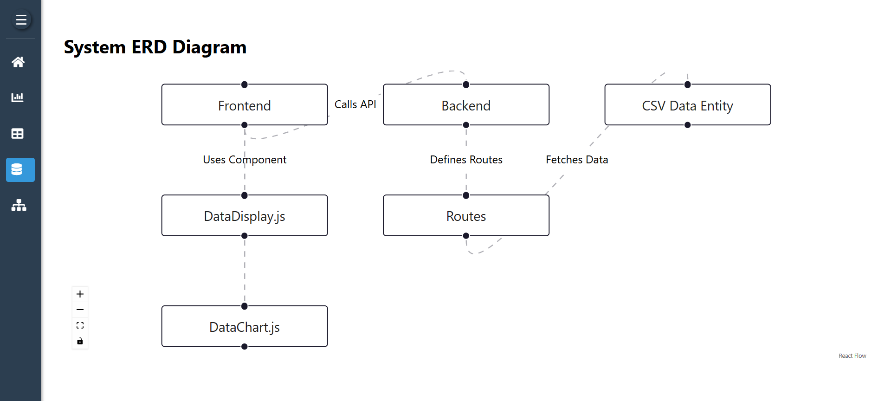
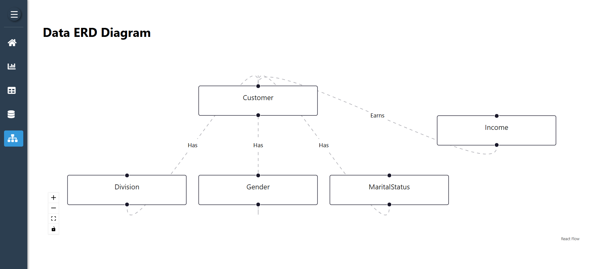

# Task 2: Fullstack Project

## Table of Contents
- [Overview](#overview)
- [Features](#features)
- [Folder Structure](#folder-structure)
- [Prerequisites](#prerequisites)
- [Installation and Setup](#installation-and-setup)
  - [Clone the Repository](#1-clone-the-repository)
  - [Set Up Backend](#2-set-up-backend)
  - [Set Up Frontend](#3-set-up-frontend)
  - [Access the Application](#4-access-the-application)
- [Usage](#usage)
- [Technologies Used](#technologies-used)
- [Screenshots](#screenshots)
- [Contributing](#contributing)
- [License](#license)

## Overview

This project demonstrates a full-stack application with a **backend** built using Node.js and Express and a **frontend** built using React. The project is designed to visualize and manage data with features like data charts, filters, and entity relationship diagrams (ERDs).

## Features

- **Frontend**: A React-based dashboard with reusable components such as:
  - Data Table Display
  - Data Filtering
  - Data Charts
  - Entity Relationship Diagrams (ERD)
- **Backend**: RESTful API to fetch and process CSV data.
- Fully modular folder structure for scalability and maintainability.

## Folder Structure

Here's the folder structure of the project:

```
task2/
├── backend/
│   ├── controllers/
│   │   ├── dataControllers.js       # Handles logic for fetching and parsing CSV data
│   ├── routes/
│   │   ├── dataRoutes.js            # Defines API endpoints for CSV data operations
│   ├── .env                         # Environment variables for sensitive information like API keys
│   ├── app.js                       # Entry point for the backend server, sets up routes and middleware
│   ├── package.json                 # Node.js dependencies and project metadata
│
├── frontend/
│   ├── assets/                      # Contains project assets such as images, screenshots, and other media files
│   │   ├── HomePage.png             # Screenshot for HomePage
│   │   ├── Chart.png                # Screenshot for Chart
│   │   ├── SystemERD.png            # Screenshot for System ERD Diagram
│   │   ├── DataERD.png              # Screenshot for Data ERD Diagram
│   ├── src/
│   │   ├── components/
│   │   │   ├── DataDisplay.js       # Component to display tabular data fetched from the backend
│   │   │   ├── DataChart.js         # Component to visualize data as charts (e.g., bar, line charts)
│   │   │   ├── FilterBar.js         # Component to filter displayed data based on user criteria
│   │   │   ├── Sidebar.js           # Sidebar navigation for the application
│   │   │   ├── SidebarContext.js    # Context for managing Sidebar state globally
│   │   │   ├── DashboardLayout.js   # Layout component for dashboard pages
│   │   │   ├── SystemERD.js         # Component to display System Entity Relationship Diagram
│   │   │   ├── DataERD.js           # Component to display Data Entity Relationship Diagram
│   │   ├── styles/
│   │   │   ├── Sidebar.css          # Styles for Sidebar component
│   │   │   ├── DashboardLayout.css  # Styles for Dashboard layout component
│   │   │   ├── FilterBar.css        # Styles for FilterBar component
│   │   ├── pages/
│   │   │   ├── HomePage.js          # Main page containing DashboardLayout and overview of app
│   │   │   ├── ChartPage.js         # Page for displaying charts with visual analytics
│   │   │   ├── TablePage.js         # Page for displaying tabular data
│   │   │   ├── SystemERDPage.js     # Page for viewing System ERD diagram
│   │   │   ├── DataERDPage.js       # Page for viewing Data ERD diagram
│   │   ├── utils/
│   │   │   ├── api.js               # Helper functions for making API requests to the backend
│   │   │   ├── config.js            # Stores application configuration, such as API BASE_URL
│   │   ├── App.js                   # Main React component that defines routes and app structure
│   │   ├── index.js                 # Entry point for the React application
│
├── README.md                        # Overall project documentation (frontend & backend setup instructions)
```

## Prerequisites

Before running the project, make sure you have the following installed:

- Node.js (>= 14.x)
- npm or yarn
- A modern web browser (for the frontend)

## Installation and Setup

### 1. Clone the Repository
```bash
git clone https://github.com/ilhamclive/Renata-PLC.git
```

### 2. Navigate to the repository folder:
```bash
cd Renata-PLC
cd task2
```

### 3. Set Up Backend

- Navigate to the `backend` directory:
  ```bash
  cd backend
  ```
- Install dependencies:
  ```bash
  npm install
  ```
- Create a `.env` file in the `backend` directory and add the following variables:

  ```
  PORT=5000
  CSV_URL=https://docs.google.com/spreadsheets/d/1FmYWCgVVsHIFoTPfH39gTBCeL1Oz8n-c/export?format=csv&gid=1965934895
  ```

  - **PORT**: Specifies the port number on which the backend server will run. Default: `5000`.
  - **CSV_URL**: The public Google Sheets link to export data in CSV format. Replace this with your own link if using a different data source.

- Start the server:
  ```bash
  npm start
  ```

### 4. Set Up Frontend

- Navigate to the `frontend` directory:
  ```bash
  cd ../frontend
  ```
- Install dependencies:
  ```bash
  npm install
  ```
- Start the development server:
  ```bash
  npm start
  ```

### 5. Access the Application

- Open your browser and navigate to `http://localhost:3000` for the frontend.
- Backend runs on `http://localhost:<PORT>` as defined in `.env`.

## Usage

- Use the **filter bar** to narrow down data.
- Visualize income distribution per division using charts.
- Explore System and Data ERDs for an overview of relationships.

## Technologies Used

- **Frontend**: React, Chart.js, React Flow
- **Backend**: Node.js, Express
- **Other Tools**: CSV Parsing libraries, Context API

## Screenshots

### HomePage


### Chart


### System ERD Diagram


### Data ERD Diagram



## Contributing

Contributions are welcome! Please fork the repository and create a pull request with your changes.

## License

This project is licensed under the MIT License.
```
